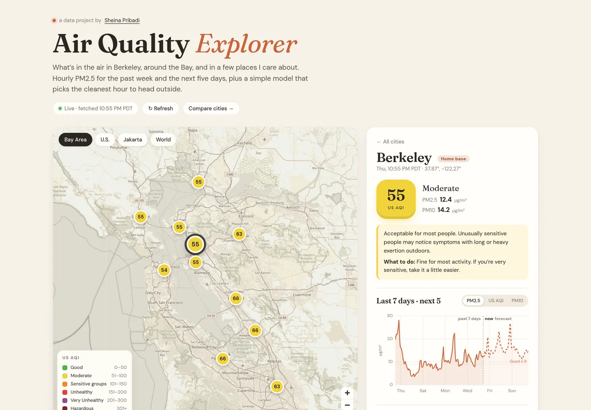
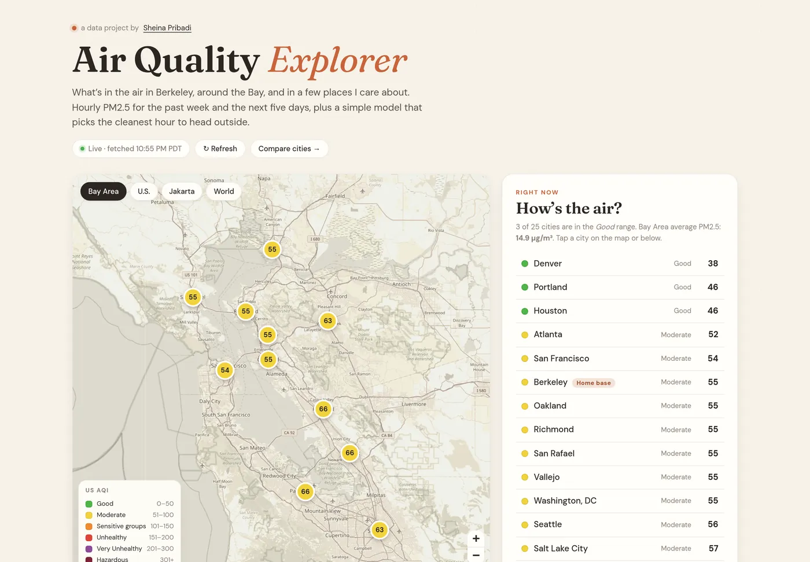
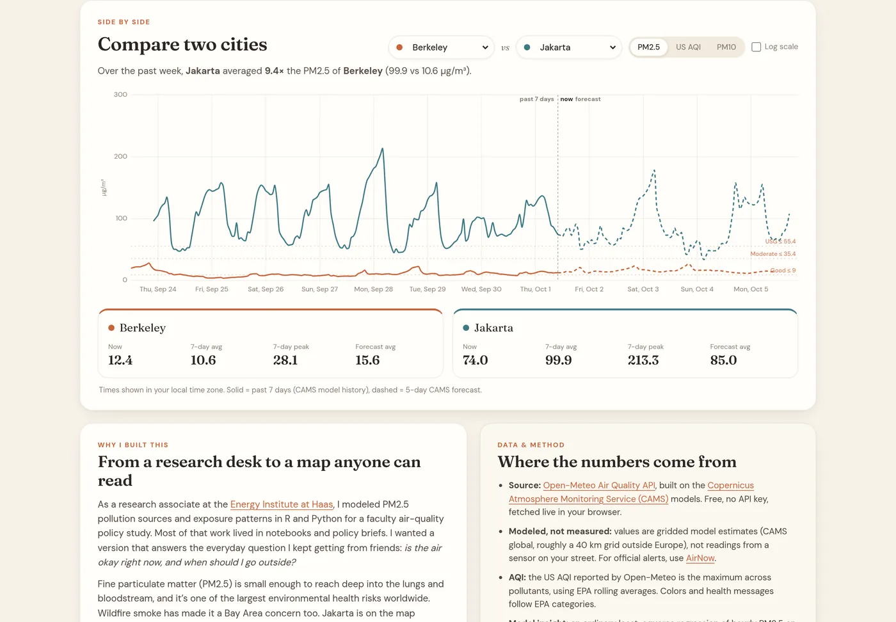
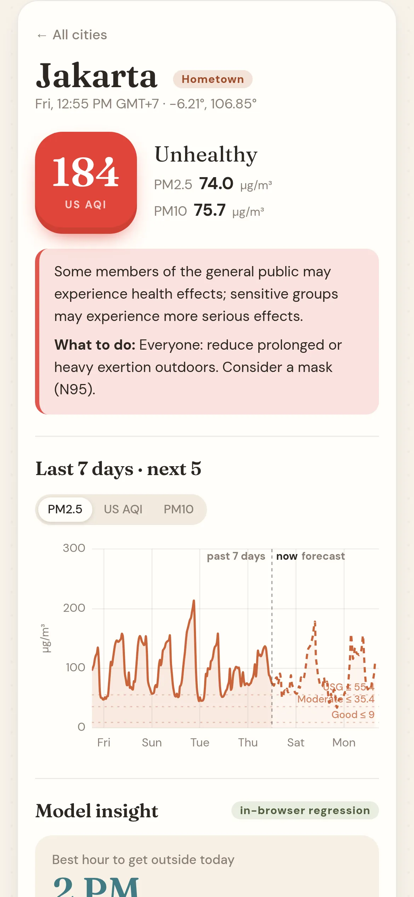

# Air Quality Explorer

**Live, hourly PM2.5 and US AQI for the Bay Area, major U.S. cities, and Jakarta, with a small in-browser model that picks the cleanest hour to head outside.**

**Live site: [sheinapribadi-star.github.io/air-quality-explorer](https://sheinapribadi-star.github.io/air-quality-explorer/)**



I spent a year as a research associate at the [Energy Institute at Haas](https://haas.berkeley.edu/energy-institute/), modeling PM2.5 pollution sources and exposure patterns in R and Python for a faculty air-quality policy study. That work lived in notebooks and policy briefs. This project turns the same kind of data into something anyone can read in ten seconds: *is the air okay right now, and when should I go outside?*

## Features

- **Map**: 25 curated cities (11 in the Bay Area, plus Sacramento, Fresno, LA, other major U.S. metros, and Jakarta, my hometown). Each marker is colored by its current US AQI on the EPA scale and shows the number. There's a legend and quick region views (Bay Area / U.S. / Jakarta / World).
- **City panel**: current US AQI, PM2.5 and PM10, a plain-English EPA health message with a "what to do" line, and a 7-day history + 5-day forecast chart (PM2.5 / AQI / PM10) with EPA breakpoint guides.
- **Model insight**, clearly labeled:
  - *Best hour to get outside*: the lowest-PM2.5 hour between 6 AM and 9 PM in the CAMS forecast for today (or tomorrow, if it's late).
  - *Usually cleanest hour*: an OLS regression fit in the browser on the city's past week, `PM2.5 ~ b0 + b1·day + sin/cos(2πh/24) + sin/cos(4πh/24)`. It reports the fitted daily cycle, the week trend (µg/m³ per day), and R². Observed hourly means are plotted against the fitted curve. When R² is low, the UI says so.
- **Compare two cities**: overlays both series on one chart (in your local time zone), with an optional log scale, stat cards (now, past-week average and peak, forecast average), and a one-line summary like *"Jakarta averaged 10× the PM2.5 of Berkeley"*.
- **About + methods**, with data credits.
- Responsive and mobile friendly. Shareable deep links: `?city=jakarta`, `?region=us`, `?a=oakland&b=fresno`.

| Overview | Compare | Mobile |
|---|---|---|
|  |  |  |

## Tech

- [Vite](https://vite.dev/) + vanilla JavaScript (ES modules). No framework, no backend, **no API keys**.
- [Leaflet](https://leafletjs.com/) with OpenStreetMap raster tiles, muted with a CSS filter to fit the warm palette.
- [Chart.js](https://www.chartjs.org/) for time series and the daily-cycle chart.
- Self-hosted fonts via Fontsource: *Fraunces* (serif headings) + *DM Sans* (body).
- The regression is hand-rolled (normal equations + Gaussian elimination, about 60 lines in `src/insight.js`).

```
src/
  main.js      app: map, panel, comparison, boot
  data.js      single batched Open-Meteo request (all 25 cities) + 30-min sessionStorage cache
  insight.js   OLS harmonic regression + best-hour logic
  charts.js    Chart.js setup, "now" marker and EPA guide-line plugins
  aqi.js       EPA categories, colors, health messages, PM2.5 breakpoints
  cities.js    curated city list + map regions
scripts/screenshots.mjs   Playwright screenshot capture
```

## Run it

Requires Node 20.19+ (or 22.12+).

```bash
npm install
npm run dev        # http://localhost:5173
npm run build      # static site in dist/
npm run preview    # serve the build at http://localhost:4173/air-quality-explorer/
```

Regenerate the screenshots with `npm run preview` running in another terminal:

```bash
npm run screenshots   # uses /usr/bin/google-chrome; override with CHROME_PATH=/path/to/chrome
```

The script writes full-resolution PNGs; the copies committed in `screenshots/` are resized WebP (about 1.6 MB total) to keep the repo small.

### Deploying (free)

The live site deploys automatically: every push to `main` runs [`.github/workflows/deploy.yml`](.github/workflows/deploy.yml), which builds with Vite and publishes `dist/` to GitHub Pages (`actions/upload-pages-artifact` + `actions/deploy-pages`).

Production builds use `base: '/air-quality-explorer/'` (see `vite.config.js`) to match the GitHub Pages project URL. To host at a domain root instead (Netlify, Vercel, a custom domain), build with `BASE_PATH=/ npm run build` and serve `dist/`.

## Data source

- **[Open-Meteo Air Quality API](https://open-meteo.com/en/docs/air-quality-api)**: free, keyless, CORS-enabled. Data is licensed [CC BY 4.0](https://creativecommons.org/licenses/by/4.0/).
- The underlying model is the **[Copernicus Atmosphere Monitoring Service (CAMS)](https://atmosphere.copernicus.eu/)** global atmospheric composition forecast.
- Request: `hourly=pm2_5,pm10,us_aqi`, `current=pm2_5,pm10,us_aqi`, `past_days=7`, `forecast_days=5`, `timezone=auto`. All cities go in one call (comma-separated coordinates).
- Map tiles © [OpenStreetMap](https://www.openstreetmap.org/copyright) contributors.

## Honest limitations

- **Modeled, not measured.** Values are CAMS grid-cell estimates (about a 40 km grid outside Europe), not sensor readings. Nearby Bay Area cities often share nearly identical values, and local hotspots (freeways, the Port of Oakland, Richmond refinery) won't show up. For official alerts, use [AirNow](https://www.airnow.gov/). Folding in PurpleAir/AirNow sensors would be a natural v2.
- **AQI.** Open-Meteo's US AQI is the maximum across pollutants and uses EPA rolling averages (24 h for PM). An hourly PM2.5 spike won't move the AQI right away.
- **The "model" is descriptive.** One week of hourly data and a harmonic regression capture a typical daily cycle and a trend. It doesn't forecast. The best-hour recommendation comes straight from the CAMS forecast.
- Marker colors are a slightly softened version of the official EPA/AirNow palette (same hue order), chosen to fit the design.

## License

MIT © Sheina Pribadi
